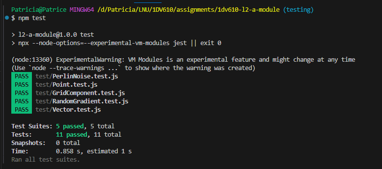

# Testrapport

För att testa modulen har automatiska enhetstester med Jest använts.

| Testnamn      | Hur det testats | Resultat  | 
| --------- |:----:| :---:|
| Perlin noise values     | Olika värden på x och y har testats för att jämföra med det förväntade resultatet. | 1/OK    |
| Changing coordinates     |  | 1/OK    |
| NaN in coordinates   |  | 1/OK    |
| Non number in coordinates   |  | 1/OK    |
| Changing coordinates to non number   |  | 1/OK    |

